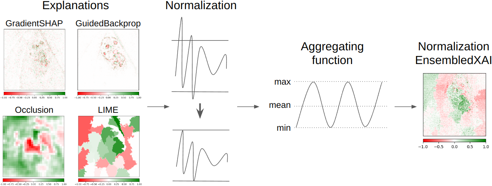
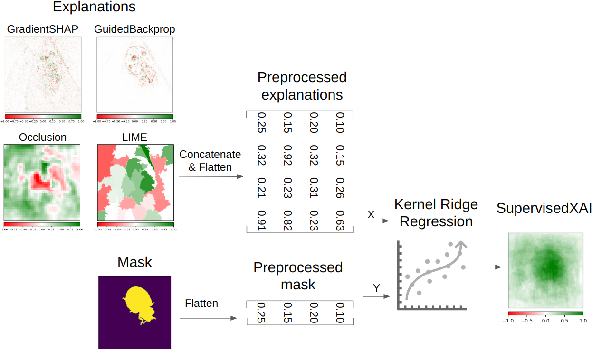
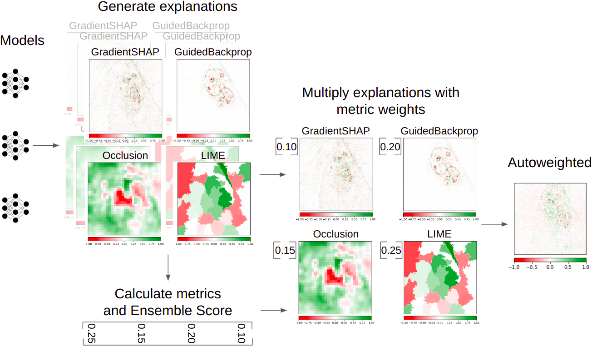

# EnsembleXAI
<!-- <hr/> -->

<!--- BADGES: START --->
[](./LICENSE)
[](./docs/_build/html/index.html)

[](https://github.com/psf/black)
[](https://arxiv.org/abs/TODO)
<!--- BADGES: END --->

This repository presents the **EnsembleXAI** library, a comprehensive Python library for ensembling explainable artificial intelligence (XAI) methods. The EnsembleXAI library is designed to be user-friendly and provides various functionalities for ensembling XAI methods, evaluating them, and integrating them into your deep learning pipelines.

## Table of Contents

- [Installation](#installation)
- [Example of Workflow](#example-of-workflow)
- [About the Methods](#about-the-methods)
- [Documentation](#documentation)
- [License](#license)

## Installation

**Installation Requirements**:
- numpy >= 1.24.4
- scikit-learn >= 1.1.2
- torch >= 2.1.0

To install the package, use pip. Having built the package, just run the following command from main project directory.

```bash
 pip install dist/EnsembleXAI-0.0.1.tar.gz
 ```

If you have access to a project GitHub repository, you can download, build, and install the package via a command

```bash
pip install git+https://github.com/Hryniewska/EnsembleXAI.git
```

## Example of Workflow

1. [Choose Model to Explain](#1-choose-model-to-explain)
2. [Read an Image to Explain](#2-read-an-image-to-explain)
3. [Generate Explanations](#3-generate-explanations)
4. [Stack Explanations](#4-stack-explanations)
5. [(Optional) Normalize Explanations](#5-optional-normalize-explanations)
6. [Ensemble Your Explanations](#6-ensemble-your-explanations)
7. [Visualize Your Results](#7-visualize-your-results)
8. [(Optional) Calculate Quality Metric](#8-optional-calculate-quality-metric)

### 1. Choose Model to Explain

First, select a pre-trained model to be explained. This example uses the `resnet18` model from the `torchvision` library:

```python
from torchvision.models import resnet18

# Load a pretrained model
model = resnet18(weights='IMAGENET1K_V1')
model = model.eval()
```

### 2. Read an Image to Explain
Next, read in an image and preprocess it to match the model's input requirements. The image will be resized to 224x224 pixels, which is the expected input size for the `resnet18` model.

```python
import cv2

# Load and preprocess the image
img = cv2.imread("path_to_image.jpg")  # Replace with the path to your image
img = cv2.resize(img, (224, 224))      # Resize the image to fit the model input size
```

### 3. Generate Explanations
Now, use the Captum library to generate explanations for the image. You can also use any other library, but the output type and shape should be the same as in the Captum library. This example demonstrates the usage of three different methods: Integrated Gradients, GradientShap, and Saliency.

```python
import torch
from captum.attr import IntegratedGradients, GradientShap, Saliency

# Prepare the input for the model
inputs = torch.tensor(img).unsqueeze(0).float()  # Add batch dimension and convert to tensor

# Generate explanations using different methods
ig = IntegratedGradients(model).attribute(inputs, target=3)
gs = GradientShap(model).attribute(inputs, target=3)
sal = Saliency(model).attribute(inputs, target=3)
```

### 4. Stack Explanations
Stack the generated explanations to create a consolidated tensor for further processing:

```python
# Stack the explanations
concatenated_explanations = torch.stack([ig, gs, sal], dim=1)
```
### 5. (Optional) Normalize Explanations
Normalization of explanations is recommended before using the NormEnsembleXAI method. Normalize the stacked explanations using, for example, the second_moment_normalize function to ensure they are on the same scale before ensembling:

```python
from EnsembleXAI.Normalization import second_moment_normalize

# Normalize explanations using Second Moment Scaling
normalized_explanations = second_moment_normalize(concatenated_explanations)
```

### 6. Ensemble Your Explanations
Use the NormEnsembleXAI method with an averaging function to ensemble the explanations into a final output:

```python
from EnsembleXAI.Ensemble import normEnsembleXAI

# Use NormEnsembleXAI with 'avg' aggregation function
output_normEnsembleXAI = normEnsembleXAI(normalized_explanations, aggregating_func='avg')
```
### 7. Visualize Your Results
Visualize the original image alongside the ensembled explanations:

```python
import matplotlib.pyplot as plt
from captum.attr import visualization as viz

# Create a figure to visualize the original image and ensembled explanation
fig, ax = plt.subplots(1, 2, figsize=(12, 3))

# Display the original image
ax[0].imshow(img)
ax[0].set_axis_off()
ax[0].set_title("Original Image")

# Display the NormEnsembleXAI explanation
viz.visualize_image_attr(
    output_normEnsembleXAI.numpy().transpose(1, 2, 0), plt_fig_axis=(fig, ax[1]), use_pyplot=False, title='NormEnsembleXAI'
)
```
### 8. (Optional) Calculate Quality Metric
Finally, it is possible to assess the quality of the explanations in dirrent ways. Here, calculate the consistency between two explanation methods (e.g., Integrated Gradients and GradientShap) using the consistency metric from EnsembleXAI:

```python
from EnsembleXAI.Metrics import consistency

# Calculate the consistency between Integrated Gradients and GradientShap
consistency_score = consistency(output_normEnsembleXAI, if)
print(f"Consistency Score between NormEnsembleXAI and IG: {consistency_score}")
```

## About the methods

### NormEnsembleXAI

The NormEnsembleXAI method is designed to handle the diverse value ranges produced by various explanation methods. The algorithm employs normalization techniques, including Second Moment Scaling, Normal Standardization, or Robust Standardization. Subsequently, it utilizes aggregation functions for ensembling explanations, including Maximum, Minimum, and Mean.



`NormEnsembleXAI`: [Hryniewska-Guzik, W., Sawicki, B., & Biecek, P. (2024). NormEnsembleXAI: Unveiling the Strengths and Weaknesses of XAI Ensemble Techniques.](https://arxiv.org/abs/2401.17200)

### SupervisedXAI

In SupervisedXAI method, explanations for an instance are reshaped and concatenated into a matrix, which constitutes the training dataset X. The segmentation mask is similarly reshaped into a one-dimensional vector, serving as a set of labels Y. A multioutput Kernel Ridge Regression (KRR) model is then trained to predict the values of Y, using the explanations transformed into the X matrix as input.



 `SupervisedXAI`: [Zou, L., Goh, H. L., Liew, C. J. Y., Quah, J. L., Gu, G. T., Chew, J. J., Prem Kumar, M., Ang, C. G. L., & Ta, A. (2022). Ensemble image explainable AI (XAI) algorithm for severe community-acquired pneumonia and COVID-19 respiratory infections. IEEE Transactions on Artificial Intelligence, 1–1.](https://doi.org/10.1109/TAI.2022.3153754)

### Autoweighted

In Autoweighted method, explanations are assessed using a chosen metric, and subsequently, an Ensemble Score (ES) is computed for each explanation method. The final XAI ensemble is constructed as a weighted mean of normalized explanations, with individual weights determined by their respective ES values.



`Autoweighted`: [Bobek, S., Bałaga, P., & Nalepa, G. J. (2021). Towards Model-Agnostic Ensemble Explanations. Lecture Notes in Computer Science (Including Subseries Lecture Notes in Artificial Intelligence and Lecture Notes in Bioinformatics), 12745 LNCS, 39–51.](https://doi.org/10.1007/978-3-030-77970-2_4)

## How to Cite

If you use the EnsembleXAI library in your research, please cite:

```bibtex
@article{hryniewskaguzik2024, 
title={NormEnsembleXAI: Unveiling the Strengths and Weaknesses of XAI Ensemble Techniques}, 
author={Weronika Hryniewska-Guzik and Bartosz Sawicki and Przemysław Biecek},
year={2024},
eprint={2401.17200},
url={https://arxiv.org/abs/2401.17200}, 
}
```


## Documentation

The EnsembleXAI library consists of three main modules:

The `Ensemble` module provides functionalities for ensembling explanations from various XAI methods. It allows you to aggregate multiple explanations using methods such as Maximum, Minimum, and Mean.

The `Metrics` module contains various explainability metrics, primarily those introduced in Zou et al. and Bobek et al.. These metrics allow you to evaluate the quality and reliability of the ensembled explanations.

The `Normalization` module provides scaling and standardizing functions to handle the diverse value ranges produced by different explanation methods. You can use these functions to preprocess your explanations before ensembling.


The complete documentation for EnsembleXAI is available here: [EnsembleXAI Documentation](https://hryniewska.github.io/EnsembleXAI/).

## License

This project is licensed under the BSD License. See the [LICENSE](LICENSE) file for details.
